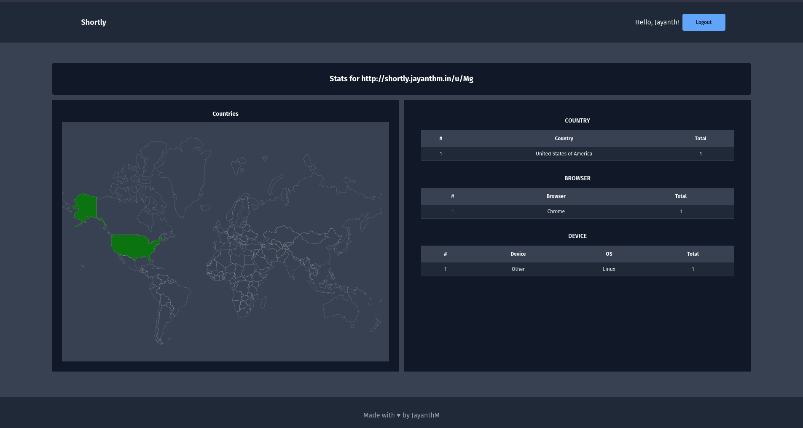

# Shortly - URL Shortener

Live link/demo to the project: [Shortly](https://shortly.jayanthm.in)

### Summary:

Here are some cool features I've packed into this project:

* User Authentication with JWT token
* Create and Delete Short URLs with a sleek, responsive UI using TailwindCSS
* URL Statistics:
   * Geo-Tracking: Visualize visits based on country with a responsive map
   * Device, Browser, OS stats through User Agent parsing

Here's a sneak peek of what I've used to build this:

* Used Redux Toolkit for seamless state management in the React app.
* Employed rtk-query to interact seamlessly with the Spring REST API.
* Used the package 'react-svg-worldmap' to render the map and populate country data.

Backend magic:

* Implemented URL shortening by encoding the primary key into a URL-safe base64 format.
* Checked for unique IP visits, storing country info based on Cloudflare headers.
* Parsed user agent details using ua-parser and stored browser, device, and OS data.
* Exposed endpoints for retrieving these stats.

I've also set up Dockerfiles and Docker Compose as part of docker learning process if someone really wants to test it out in their system. I'm a bit old-school tho, so opted for manual deployment for the demo. Deployed the JAR file to my Linux droplet, set up Nginx as a reverse proxy, and that's it!

Quick note: If you want to use this project for production or deploy it live, Make sure you change the environment variables (check the docker files for a clear example). Especially, the secret key used for JWT tokens.

### Docker Compose:

>  docker compose up

Application UI will be live at: http://localhost:3000

Backend API will be live at: http://localhost:9002/u/

### Backend API Docs:

>  http://localhost:9002/u/swagger-ui/index.html#/

